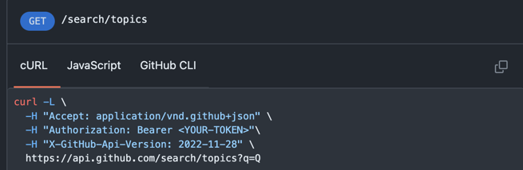
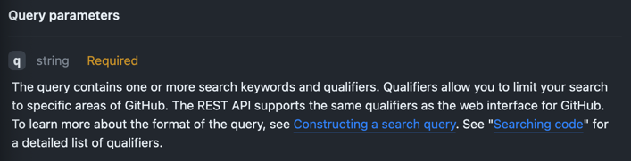
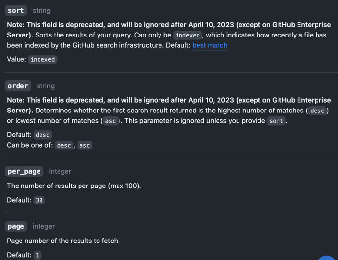
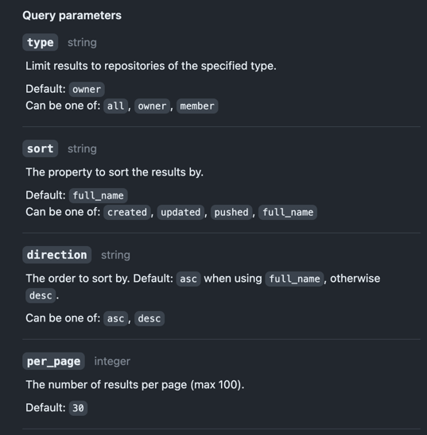
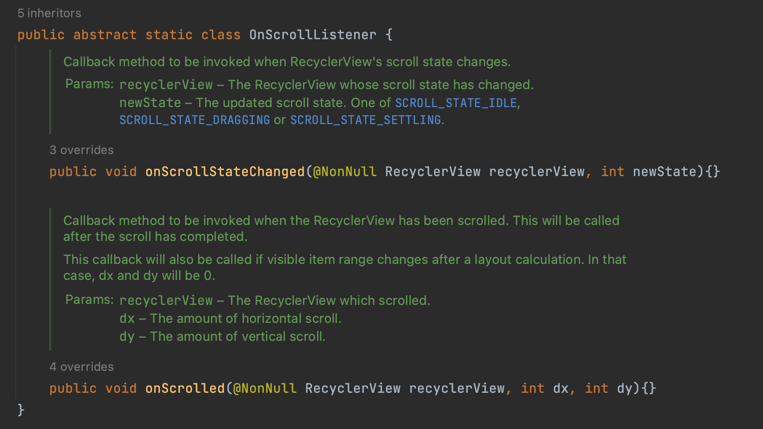

# Android_Network_2

깃허브 레포지토리 조회하기 - Retrofit, GitHub Open API, RecyclerView, ListAdapter, Handler

## GitHub Open API

- BASE_URL: api.github.com
  [GitHub Open API](https://docs.github.com/ko/rest?apiVersion=2022-11-28)

- API: 애플리케이션 프로그래밍 인터페이스
- REST: Representational State Transfer, 일종의 네트워크에서 통신을 관리하기 위한 아키텍쳐

### **[Rate limit](https://docs.github.com/en/rest/search?apiVersion=2022-11-28#about-search)**

> The REST API has a custom rate limit for searching. For authenticated requests, you can make up to
> 30 requests per minute for all search endpoints except for the "Search code" endpoint. The "Search
> code" endpoint requires you to authenticate and limits you to 10 requests per minute. For
> unauthenticated requests, the rate limit allows you to make up to 10 requests per minute.

- 1분에 10번으로 제한 되므로 토큰을 발급 받아 API 횟수를 늘리는 것이 좋다.
- 주의할 점은 해당 토큰을 사용하고 그대로 개인 public 원격 레포에 공유할 경우 중요한 정보들이 유출될 수 있다는 것이다. 토큰을 공개하지 않도록 주의할 것.
  

### **Headers**

- 어떤 유저를 검색할 것인지 명시
  
- 다른 여러 헤더들 존재
  

### Response

Example: https://api.github.com/search/users?q=yibeomseok

```json
{
  "total_count": 1,
  "incomplete_results": false,
  "items": [
    {
      "login": "YiBeomSeok",
      "id": 77970380,
      "node_id": "MDQ6VXNlcjc3OTcwMzgw",
      "avatar_url": "https://avatars.githubusercontent.com/u/77970380?v=4",
      "gravatar_id": "",
      "url": "https://api.github.com/users/YiBeomSeok",
      "html_url": "https://github.com/YiBeomSeok",
      "followers_url": "https://api.github.com/users/YiBeomSeok/followers",
      "following_url": "https://api.github.com/users/YiBeomSeok/following{/other_user}",
      "gists_url": "https://api.github.com/users/YiBeomSeok/gists{/gist_id}",
      "starred_url": "https://api.github.com/users/YiBeomSeok/starred{/owner}{/repo}",
      "subscriptions_url": "https://api.github.com/users/YiBeomSeok/subscriptions",
      "organizations_url": "https://api.github.com/users/YiBeomSeok/orgs",
      "repos_url": "https://api.github.com/users/YiBeomSeok/repos",
      "events_url": "https://api.github.com/users/YiBeomSeok/events{/privacy}",
      "received_events_url": "https://api.github.com/users/YiBeomSeok/received_events",
      "type": "User",
      "site_admin": false,
      "score": 1.0
    }
  ]
}
```

## RecyclerView

- [LayoutManager](https://developer.android.com/reference/androidx/recyclerview/widget/RecyclerView.LayoutManager)

## ListAdapter

ListView나 GridView와 같은 AdapterView의 데이터를 관리하고 표시하는 역할.

이 클래스는 여러 아이템을 가진 리스트를 화면에 보여주기 위한 매개체 역할을 수향하며, 사용자가 데이터와 사용자 인터페이스를 독립적으로 관리할 수 있도록 도와준다.

### 예시

1. `activity_main.xml` 파일에 ListView를 추가

```xml

<LinearLayout xmlns:android="http://schemas.android.com/apk/res/android"
    xmlns:app="http://schemas.android.com/apk/res-auto"
    xmlns:tools="http://schemas.android.com/tools" android:layout_width="match_parent"
    android:layout_height="match_parent" android:orientation="vertical"
    tools:context=".MainActivity">

    <ListView android:id="@+id/listView" android:layout_width="match_parent"
        android:layout_height="match_parent" />
</LinearLayout>
```

2. `MainAcitivty.kt`에서 ListAdapter를 설정

```kotlin
import android.os.Bundle
import android.widget.ArrayAdapter
import androidx.appcompat.app.AppCompatActivity
import kotlinx.android.synthetic.main.activity_main.*

class MainActivity : AppCompatActivity() {

    private val items = listOf("Item 1", "Item 2", "Item 3", "Item 4", "Item 5")

    override fun onCreate(savedInstanceState: Bundle?) {
        super.onCreate(savedInstanceState)
        setContentView(R.layout.activity_main)

        // ArrayAdapter를 생성하고, 리스트 뷰의 어댑터로 설정합니다.
        val adapter = ArrayAdapter<String>(this, android.R.layout.simple_list_item_1, items)
        listView.adapter = adapter

        // 리스트 뷰의 아이템 클릭 리스너를 설정합니다.
        listView.setOnItemClickListener { _, _, position, _ ->
            val selectedItem = adapter.getItem(position)
            Toast.makeText(this, "Selected: $selectedItem", Toast.LENGTH_SHORT).show()
        }
    }
}
```

문자열 목록을 `items`변수에 저장하고, 이를 ArrayAdapter에 전달하여 간단한 문자열 목록을 ListView에 표시한다. 또한, ListView의 아이템 클릭 리스너를
설정하여 사용자가 선택한 아이템을 표시한다.

현재 프로젝트에서는 Retrofit, GitHub Open API, RecyclerView, ListAdapter, Handler 등을 이용하여 UI와 네트워크 통신을 구현하도록
할 것이다.

## 페이징 처리



- 문서를 확인해보면, API를 호출할 시에 `per_page` 기본값이 30으로 되어있는 것을 확인할 수 있다.
- 기본적으로 30개의 페이지, 최대 100개(max 100)의 페이지를 보여줄 수 있다는 것을 확인.
- 만일 다음 30개 이후의 페이지를 보고자 한다면 쿼리를 수정해야 한다. (`page=<pagenumber>`)


- recyclerview의 `addOnScrollListener`를 이용하여 기능을 추가한다. 

### 마지막 아이템을 판별하는 방법

```kotlin
binding.repoRecyclerView.addOnScrollListener(object : RecyclerView.OnScrollListener() {
            override fun onScrolled(recyclerView: RecyclerView, dx: Int, dy: Int) {
                super.onScrolled(recyclerView, dx, dy)

                val totalCount = linearLayoutManager.itemCount
                val lastVisiblePosition =
                    linearLayoutManager.findLastCompletelyVisibleItemPosition()

                if (lastVisiblePosition >= totalCount - 1 && hasMore) {
                    listRepo(username, ++page)
                }
            }
        })
```

- totalCount와 lastVisiblePosition 값을 구하여 비교해줄 수 있다.
- 또한 hasMore 변수를 선언하여 다음 페이지가 없는 경우 더 불러오는 것을 방지한다.
